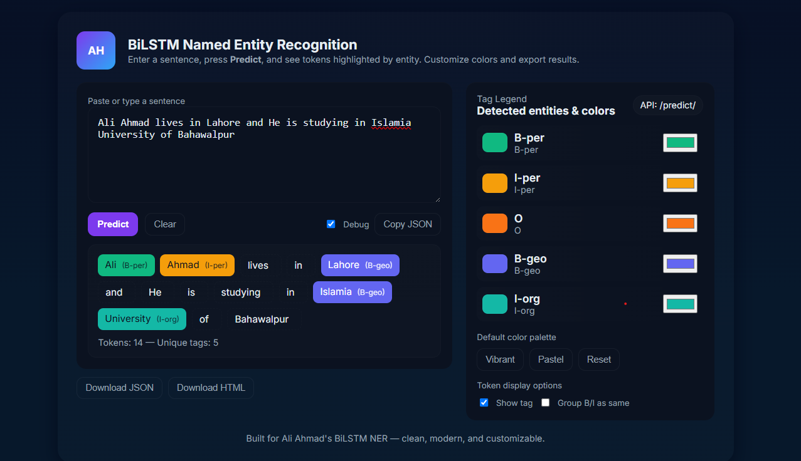

# 🧠 Named Entity Recognition (NER) using BiLSTM + Softmax

This is my deep learning project for **Named Entity Recognition (NER)** where I used a **BiLSTM model with Softmax** activation.  
The goal of this project is to identify entities like **Person, Organization, Location, Time, etc.** from a given sentence.

---
## 🖼️ Project Screenshot

Here is how the UI looks:



## 🚀 My Journey

At first, I tried to build a **BiLSTM-CRF** model.  
I spent a lot of time on it but I faced many issues and errors because **CRF is an old technique** and it depends on a library called `keras_contrib` which is not available for **Python 3.12.12** (my default version in Google Colab).  

It also needed **TensorFlow < 2.11.0**, so I tried to downgrade both Python and TensorFlow — but it caused more compatibility problems.

After facing so many errors, I decided to move from **BiLSTM-CRF** to **BiLSTM with Softmax**.  
It worked perfectly with **TensorFlow 2.19.0** and gave almost the **same accuracy** as the CRF version, but with no errors or version issues.

---

## ✅ Model Performance

- Model used: **BiLSTM + Softmax**
- Test Accuracy: **98.8%**
- Framework: **TensorFlow / Keras**
- Max Sequence Length: 75
- Optimizer: Adam

The model performs really well on test data and gives clean predictions for each token in a sentence.

---

## 🧩 How It Works

1. I trained a BiLSTM model that takes a sequence of words.
2. Each word is converted into an index using a `word2index.pkl` mapping.
3. The model predicts the most likely tag for every word.
4. Tags are mapped back using `index2tag`.
5. Example tags include:  
   - `B-per`: Beginning of a person name  
   - `I-org`: Inside an organization name  
   - `O`: Not an entity  

---

## ⚙️ Backend – FastAPI

After training the model, I built a simple **FastAPI backend**.  
It loads the trained model and exposes two endpoints:

- `/` → Shows the frontend UI
- `/predict/` → Takes user text and returns NER predictions

The model is automatically loaded from the `model/` folder when the server starts.

---

## 💻 Frontend – Modern UI

I also created a **simple and modern UI** using HTML, CSS, and JavaScript.  
It allows the user to enter a sentence, sends it to the FastAPI backend, and shows the results in a colorful and readable format (each entity type is highlighted with a different color).

---

## 🧰 Project Structure

named_entity_recognition/
│
├── app/
│ ├── main.py
│ ├── model_loader.py
│ └── test.py
│
├── model/
│ ├── ner_model.h5
│ └── word2index.pkl
│
├── templates/
│ └── index.html
│
└── README.md

## 🪄 How to Run

1. Clone the repository  
   ```bash
   git clone https://github.com/aliahmad552/named_entity_recognition.git
   cd named_entity_recognition
   ```

2. Install dependencies
```bash
pip install -r requirements.txt
```

3. Run the app
```bash
uvicorn app.main:app --reload
```

4. Open your browser and visit
```bash
👉 http://127.0.0.1:8000
```
